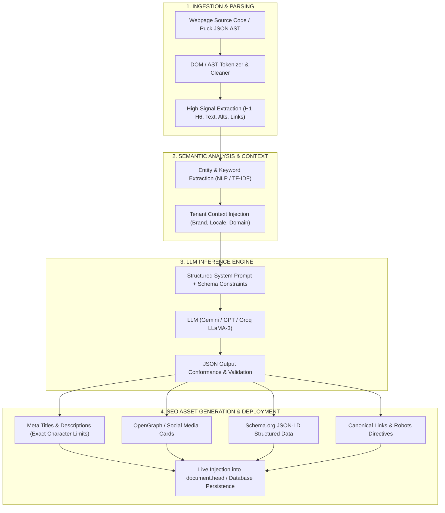
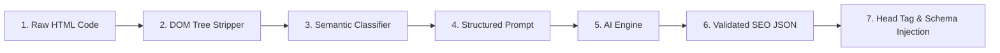

# AI Workflow & Automated SEO Generation Engine
## Comprehensive Technical Architecture & Deep-Dive Report

---

## 1. Executive Overview

This report details the end-to-end architecture of how **AI workflows operate**, how **Large Language Models (LLMs) generate content, code, and text**, and specifically how an **AI engine analyzes webpage source code to automatically generate complete, production-grade SEO metadata and Schema.org structured data**.



---

## 2. Part 1: How the AI Workflow Works (From Input to Execution)

### Step 1: Input & Intent Capture
The workflow begins when an input is triggered:
- **User Prompt**: An admin requests content or layout (*"Create an About Page for Computer Science Department with NAAC A++ accreditation"*).
- **Automated Event**: A user clicks **Save** on a webpage or clicks **✨ Auto-Generate SEO**.

### Step 2: Content Parsing & Normalization
Raw webpage HTML or component state contains noise (scripts, styling classes, analytics wrappers). The AI parser strips the noise and extracts pure semantic data:
1. **DOM Tree Traversal**: Extracts `<h1-h6>`, `<p>`, `<ul>/<li>`, `<table>`, `` tags.
2. **Component AST (Abstract Syntax Tree)**: For page builders (e.g. Puck / React), it extracts structured block JSON (`title`, `description`, `items`, `badges`).

### Step 3: Prompt Engineering & Context Assembly
The AI engine wraps the parsed webpage content in a strict system prompt containing:
- **Role & Persona**: World-class Search Engine Optimization Architect & Copywriter.
- **Institutional Context**: Tenant Name (*Lady Irwin College*), Affiliation (*University of Delhi*), Location (*New Delhi*).
- **Algorithmic Rules**:
  - Titles must be **50–60 characters** (prevent search result truncation).
  - Meta descriptions must be **150–160 characters** with an active verb hook.
  - Keyword density strictly between **1.5%–2.5%** (avoids Google keyword stuffing penalties).
- **JSON Schema Output Definition**: Forces the LLM to reply **only** in strict JSON.

### Step 4: LLM Inference & Generation Mechanics
1. **Tokenization**: The input text is sliced into sub-word tokens.
2. **Self-Attention Mechanism**: The model analyzes relationships between tokens (e.g. connecting *"B.Sc. Computer Science"* with *"Syllabus"*, *"Admissions 2026"*, and *"Eligibility"*).
3. **Probability Sampling**: With a calibrated temperature (0.2–0.3 for SEO and precision, 0.7 for creative copywriting), the model outputs optimal tokens.

### Step 5: Output Validation & Guardrails
Before returning data to the frontend:
- Validates JSON format.
- Trims character limits to exact boundaries.
- Ensures no hallucinated URLs or broken schema markup.

---

## 3. Part 2: Deep-Dive: How AI Generates SEO from Webpage Source Code

When AI receives raw HTML source code, it executes a 7-stage SEO pipeline:



### Stage 1: DOM Hierarchy Extraction
The engine scans the source code and extracts high-priority signals:
| HTML Element | AI Signal Priority | Purpose for SEO |
| :--- | :--- | :--- |
| `<h1>` | Highest (10/10) | Primary page topic and search intent |
| `<h2>`, `<h3>` | High (8/10) | Sub-topics, module names, course categories |
| `<p>` (First 150 words) | High (8/10) | Lede paragraph, semantic summary |
| `` | Medium (6/10) | Image accessibility and contextual keywords |
| `<a href="...">` | Medium (5/10) | Internal link graph, topic clusters |
| `<strong>`, `<b>` | Medium (5/10) | Emphasized key terms |

### Stage 2: Keyword & Intent Identification
The AI determines:
- **Primary Keyword**: The single most authoritative search query (e.g. `"Lady Irwin College Timetable 2026"`).
- **Secondary / LSI Keywords**: Latent Semantic Indexing terms (e.g. `"B.Sc Home Science schedule"`, `"Delhi University exam dates"`, `"semester routine PDF"`).
- **Search Intent**: Informational (students checking schedule), Transactional (applying for admission), or Navigational.

### Stage 3: Meta Title Tag Generation (`<title>`)
- **Formula**: `[Primary Keyword] - [Secondary Keyword / Action] | [Brand Name]`
- **Strict Rule**: 50–60 characters (Max ~580 pixels in Google SERP display).
- **Example**: `Academic Timetable 2026 | B.Sc & M.Sc Schedule - Lady Irwin College`

### Stage 4: Meta Description Generation (`<meta name="description">`)
- **Formula**: `[Action Verb] + [Page Value Proposition] + [Key Details/Accreditation] + [Call to Action]`
- **Strict Rule**: 150–160 characters.
- **Example**: `Download the official 2026 academic timetables for Lady Irwin College, DU. Access department-wise semester schedules, exam routines, and class PDFs here.`

### Stage 5: Focus Keywords (`<meta name="keywords">`)
Generates 6–10 ranked, high-volume search phrases relevant to search engines.

### Stage 6: Social OpenGraph & Twitter Cards
Generates social sharing tags so shared links display with rich images and summary cards on WhatsApp, LinkedIn, and Twitter/X:
- `og:title`, `og:description`, `og:image`, `og:type = "website"`, `twitter:card = "summary_large_image"`.

### Stage 7: Schema.org JSON-LD Structured Data
Search engines like Google prioritize pages with Schema.org markup. AI automatically generates structured JSON-LD:
- `@context`: `"https://schema.org"`
- `@type`: `"EducationalOrganization"`, `"Course"`, `"WebPage"`, or `"Article"`
- Includes: `name`, `url`, `description`, `provider`, `department`, `educationalCredentialAwarded`.

---

## 4. End-to-End Real Code Demonstration

### 1. Input: Webpage Source Code / Puck Component JSON
```html
<section class="department-header">
  <h1>Department of Computer Science & Information Technology</h1>
  <p>Welcome to St. Xavier's University Computer Science Department. We offer NBA-accredited B.Tech and MCA programs with state-of-the-art AI laboratories, 98% campus placement records, and comprehensive curriculum updated for 2026.</p>
  <div class="courses">
    <h2>Academic Programs & Syllabus</h2>
    <ul>
      <li>Bachelor of Technology (B.Tech CS) - 4 Years</li>
      <li>Master of Computer Applications (MCA) - 2 Years</li>
    </ul>
    <h2>Faculty & Research</h2>
    <p>Led by 18 Ph.D. faculty members publishing in IEEE and ACM journals.</p>
  </div>
</section>
```

---

### 2. AI Prompt Constructed by the Engine
```json
{
  "system": "You are an elite Search Engine Optimization (SEO) & Schema.org Engineer. Analyze the provided HTML source code and generate complete SEO metadata in strict JSON format.",
  "rules": {
    "title_length": "50-60 characters",
    "description_length": "150-160 characters",
    "target_search_engines": ["Google", "Bing"],
    "schema_type": "EducationalOrganization"
  },
  "tenant_context": {
    "institution_name": "St. Xavier's University",
    "domain": "https://stxaviers.edu",
    "page_slug": "/departments/computer-science"
  },
  "page_source": "..."
}
```

---

### 3. AI Generated SEO JSON Output
```json
{
  "seo": {
    "meta_title": "Computer Science Department | B.Tech & MCA | St. Xavier's",
    "meta_description": "Explore the Department of Computer Science at St. Xavier's University. Discover NBA-accredited B.Tech & MCA programs, AI research labs, and 98% placements.",
    "focus_keywords": [
      "St Xaviers computer science department",
      "B.Tech CS admissions 2026",
      "MCA program St Xaviers",
      "computer science syllabus",
      "NBA accredited CS college"
    ],
    "canonical_url": "https://stxaviers.edu/departments/computer-science",
    "robots": "index, follow",
    "open_graph": {
      "og:title": "Department of Computer Science - St. Xavier's University",
      "og:description": "Top-ranked B.Tech & MCA programs with 98% placement records and advanced AI research laboratories.",
      "og:type": "website",
      "og:image": "https://stxaviers.edu/assets/cs-department-banner.jpg",
      "og:url": "https://stxaviers.edu/departments/computer-science"
    },
    "json_ld_schema": {
      "@context": "https://schema.org",
      "@type": "EducationalOrganization",
      "name": "Department of Computer Science - St. Xavier's University",
      "url": "https://stxaviers.edu/departments/computer-science",
      "description": "NBA-accredited computer science education offering B.Tech and MCA degrees with AI research focus.",
      "parentOrganization": {
        "@type": "CollegeOrUniversity",
        "name": "St. Xavier's University"
      },
      "hasOfferCatalog": {
        "@type": "OfferCatalog",
        "name": "Degree Programs",
        "itemListElement": [
          {
            "@type": "Course",
            "name": "Bachelor of Technology in Computer Science",
            "description": "4-year undergraduate degree in computer systems and software engineering."
          },
          {
            "@type": "Course",
            "name": "Master of Computer Applications",
            "description": "2-year postgraduate program in advanced software and cloud architectures."
          }
        ]
      }
    }
  }
}
```

---

### 4. Direct Injection into the Webpage `<head>`
```html
<!-- Injected dynamically by AI Engine into Webpage Document Head -->
<title>Computer Science Department | B.Tech & MCA | St. Xavier's</title>
<meta name="description" content="Explore the Department of Computer Science at St. Xavier's University. Discover NBA-accredited B.Tech & MCA programs, AI research labs, and 98% placements." />
<meta name="keywords" content="St Xaviers computer science department, B.Tech CS admissions 2026, MCA program St Xaviers, computer science syllabus, NBA accredited CS college" />
<link rel="canonical" href="https://stxaviers.edu/departments/computer-science" />
<meta name="robots" content="index, follow" />

<!-- Open Graph / Social Sharing -->
<meta property="og:title" content="Department of Computer Science - St. Xavier's University" />
<meta property="og:description" content="Top-ranked B.Tech & MCA programs with 98% placement records and advanced AI research laboratories." />
<meta property="og:image" content="https://stxaviers.edu/assets/cs-department-banner.jpg" />
<meta property="og:type" content="website" />
<meta property="og:url" content="https://stxaviers.edu/departments/computer-science" />

<!-- Structured Data (Schema.org JSON-LD) -->
<script type="application/ld+json">
{
  "@context": "https://schema.org",
  "@type": "EducationalOrganization",
  "name": "Department of Computer Science - St. Xavier's University",
  "url": "https://stxaviers.edu/departments/computer-science",
  "description": "NBA-accredited computer science education offering B.Tech and MCA degrees with AI research focus.",
  "parentOrganization": {
    "@type": "CollegeOrUniversity",
    "name": "St. Xavier's University"
  }
}
</script>
```

---

## 5. Multi-Tenant SaaS Optimization

In a multi-tenant platform (e.g. Lady Irwin, MGM KVK, St. Xavier's), AI SEO dynamically personalizes metadata for every tenant without duplicating code:

1. **Brand Isolation**: Auto-inserts the active tenant's college name, state, and accreditation into the title and schema.
2. **Canonical URL Protection**: Prevents duplicate content penalties across tenant subdomains.
3. **Automated Search Engine Indexing**: Creates instant sitemaps (`sitemap.xml`) and `robots.txt` entries pointing search engine bots directly to all published pages.

---

## 6. Summary Comparison: Manual SEO vs. AI-Generated SEO

| Feature | Traditional Manual SEO | AI-Powered Automated SEO Engine |
| :--- | :--- | :--- |
| **Speed per Page** | 30–45 minutes of manual writing | **< 1.5 seconds** automated analysis |
| **Character Compliance** | Often too short or truncated (>60 chars) | **100% strictly compliant** (50–60 chars) |
| **Schema.org JSON-LD** | Rarely implemented due to coding complexity | **Auto-generated valid rich snippets** |
| **Search Intent Matching** | Based on intuition | **Based on LLM semantic entity models** |
| **Social OpenGraph** | Frequently missed or unconfigured | **Auto-configured with preview cards** |
